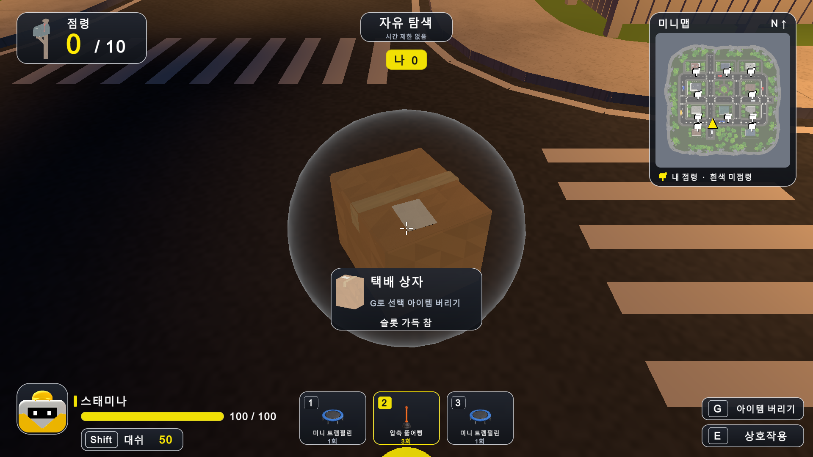
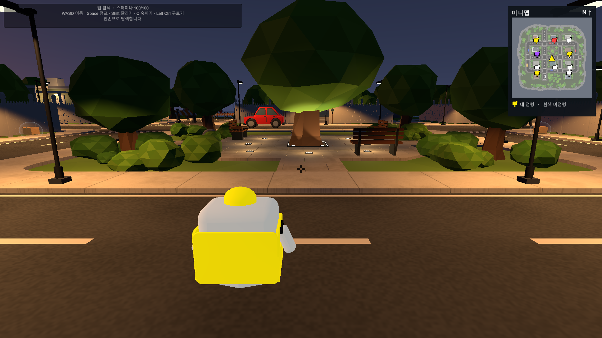
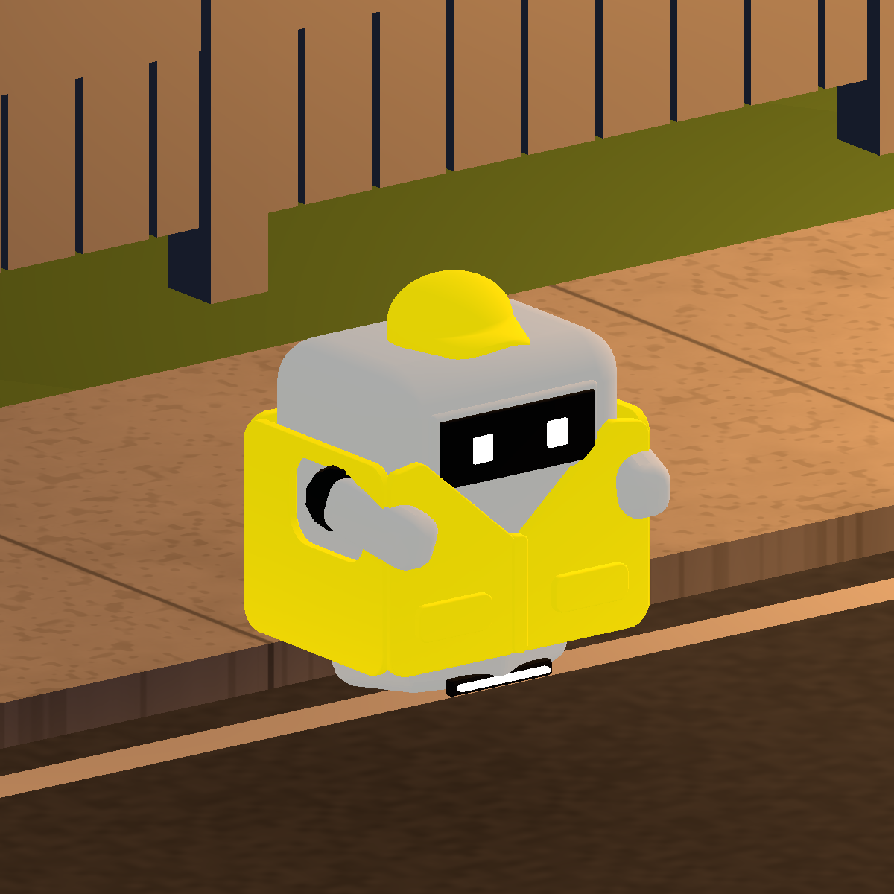

# Monster Delivery Service 기술 문서

기준일: 2026-10-08 · Unity 6000.5.10f1 · SampleScene · Built-in Render Pipeline

이 문서는 현재 코드와 Unity Editor 검증 결과를 기준으로 작성했다. 10월 6일 기술 문서와 발표 자료는 당시 구현의 기록이며, 현재 동작은 이 문서와 GAME_DESIGN.md를 따른다.

## 1. 현재 구현 범위

게임은 생활용품으로 상대의 위치·행동을 방해하며 주택가 우체통을 점령하는 개인전이다. 체력·피해·처치·사망·사망 리스폰은 제거했고 모든 슬롯이 빈 상태로 시작한다.

현재 SampleScene은 섬 맵 탐색 모드다. 1인칭 이동, 대쉬, 우체통 점령, 전체 섬 미니맵, 부유 택배의 랜덤 아이템 획득, 3칸 슬롯 선택과 영구 폐기를 직접 테스트할 수 있다. 온라인 멀티플레이와 입장 전 색 선택 화면은 아직 없다. 상단 참가자는 현재 로컬 플레이어와 실제 활성화된 봇을 기준으로 표시하며, 탐색 모드에서는 혼자만 표시한다.

아이템 공격·상태 이상·투척·영역 효과 코드는 준비되어 있지만 일반 플레이에서는 itemPlaytestEnabled=false로 사용을 막는다. 이 제한과 별도로 택배 획득 및 G 폐기는 활성화되어 있다. 손에 든 아이템 3D 모델도 아직 표시하지 않는다.

## 2. 코드와 에셋 구조

| 책임 | 위치 | 구현 |
|---|---|---|
| 게임 상태·이동·점령·인벤토리 | Assets/Gameplay/MonsterDeliveryPrototype.cs | Input System, CharacterController, 3칸 배열, 점령 소유자 배열 |
| 인게임 표시 | Assets/Gameplay/MonsterDeliveryHUD.cs | 기존 MonoBehaviour의 partial 파일, OnGUI로 패널·텍스트·슬롯 렌더 |
| 미니맵 | Assets/Gameplay/DeliveryMinimap.cs | 시작 시 512px 지도 생성, 실시간 소유권·플레이어 방향 표시 |
| 공통 상호작용 | Assets/Gameplay/InteractionTarget.cs | 사용 가능 판정에 따른 흰 메시 테두리, MaterialPropertyBlock |
| 부유 택배 | Assets/Gameplay/FloatingParcel.cs | 상하 부유·회전, 모델/보호막 일괄 수집 |
| 캐릭터 표시 | Assets/Gameplay/DeliveryRobotVisual.cs | 플레이어색 재질과 Animator 상태 연결 |
| 비살상 상태 | Assets/Gameplay/DeliveryItemState.cs | 기절·슬로우·강화·넉백/당기기 상태 |
| 우체통 에셋·배치 | Assets/Editor/DeliveryPropsPlacement.cs | FBX 재질 연결, 높이 조정 메시, 집 앞 10개 배치 |
| 택배 테스트 배치 | Assets/Editor/TestParcelDrops.cs | 허용 지면과 접근 가능한 평면 옥상에 10개 랜덤 배치 |
| 캐릭터 임포트 | Assets/Editor/DeliveryRobotPlayerSetup.cs | FBX·Generic Animator·플레이어 프리팹 구성 |
| UI 이미지 제작 | Assets/Editor/InGameUISetup.cs | 패널 PNG 생성, 모델 아이콘 렌더, 기존 상품 이미지 임포트 |

플레이어 프리팹은 Assets/Resources/Characters/DeliveryRobotPlayer.prefab, UI 이미지는 Assets/Resources/UI/InGame, 미니맵 셰이더는 Assets/Resources/MinimapFlat.shader에 있다. 기존 Unity 기능을 재사용했으며 이 작업을 위해 UI 패키지나 새로운 외부 런타임 의존성을 추가하지 않았다.

## 3. 조작과 상호작용

| 키 | 현재 동작 |
|---|---|
| WASD / 마우스 | 이동 / 시점 |
| Space | 점프 |
| C | 숙이기 |
| Shift | 대쉬. 1회 스태미나 50 |
| E 유지 | 우체통 점령·탈환, 기본 3초 |
| E 누르기 | 바라보는 부유 택배에서 랜덤 아이템 획득 |
| 1 / 2 / 3 | 해당 슬롯 선택 |
| G | 선택 아이템 즉시 영구 폐기 |

기본 시점은 1인칭이다. thirdPersonPreview는 캐릭터 검수용 옵션으로 남겼다. 중앙 조준점은 항상 표시한다. 중앙 시선의 첫 유효 고체 표면, 대상까지 거리 3m, 가림 여부, 행동 가능 상태를 함께 검사한다. 상호작용 가능한 대상만 흰 테두리를 표시한다. 단순히 조준했다는 이유로 색을 바꾸지 않는다.

대쉬는 누르는 순간 한 번 실행되며 키 유지로 반복되지 않는다. 속도 17, 지속 0.35초, 최대 스태미나 100, 대쉬 밖에서 초당 20 회복이다. 스태미나 50 미만·숙이기·기절 중이면 사용할 수 없다. 대쉬 중 상호작용을 차단하고 진행 중인 점령을 취소한다. 달리기와 Ctrl 구르기는 제거했다.

중립 또는 상대 우체통만 점령할 수 있다. E 해제, 시선 이탈, 거리 이탈, 장애물, 기절·강제 이동 등은 진행을 취소한다. 점령 완료 시 본체 재질은 유지하고 고리·입자 효과만 소유자 색으로 바꾼다. 미점령 효과는 흰색, 로컬 테스트 색은 노란색이다. SetPlayerColor가 향후 색 선택 화면의 연결 지점이다.

## 4. 택배 드랍과 파밍 흐름

현재 저장된 택배는 지상 7개와 평면 옥상 3개, 총 10개다. 지상 또는 계단으로 접근 가능한 1·3·4번 집의 평면 옥상만 후보로 사용한다. 나무·소품 위, 경사 지붕, 계단 없는 집 옥상, 가장자리와 장애물 겹침을 배제한다. 상자의 지지점과 주변 충돌체를 검사한다.

택배는 원본 대비 1.5배다. 부유 중심 높이 약 1.1m에 상하 진폭 약 0.12m와 느린 회전을 적용했다. 반투명 보호막과 은은한 빛으로 새벽 배경에서도 읽히도록 했고 비눗방울 같은 무지갯빛 표현은 줄였다.

획득 경로는 UpdateInteraction → TryPickup → FloatingParcel.TryCollect → AddWeapon이다.

1. 빈 슬롯과 거리·시선·행동 가능 상태를 확인한다.
2. 유효한 E 입력에서 10종 중 하나를 동일 확률로 뽑는다. Random.Range(1, 11)은 None을 제외한다.
3. 첫 빈 슬롯에 넣고 사용 횟수 또는 선풍기 배터리를 초기화한다. 새 슬롯을 자동 선택한다.
4. 상자와 보호막을 비활성화하고 재수집을 막는다.
5. HUD는 실제 슬롯 데이터를 읽어 기존 상품 이미지, 이름, 남은 사용량을 표시한다.

3칸이 가득 차면 기존 칸을 덮어쓰거나 상자를 소비하지 않는다. 흰 테두리와 수집 가능 상태를 끄고 “G로 선택 아이템 버리기”를 안내한다. 1·2·3으로 선택한 뒤 G를 누르면 해당 슬롯의 아이템·사용량·연결된 장갑 준비 상태만 삭제한다. 월드에 버린 아이템을 생성하지 않으며 다시 줍는 기능은 없다. 빈 슬롯이 생기면 택배 수집이 다시 가능하다.

아래 효과는 준비된 로직/기획이다. 현재 활성화된 플레이는 획득·표시·선택·폐기까지다.

| 생활용품 | 코드 종류 | 초기 사용량 | 준비된 효과 |
|---|---|---|---|
| 복싱 글러브 | BoxingGloves | 3회 | 전방 상대 넉백·띄우기 |
| 압축 뚫어뻥 | Plunger | 3회 | 상대를 사용자 쪽으로 당기기 |
| 휴대용 확성기 | Megaphone | 2회 | 준비 후 전방 기절 |
| 포장용 테이프 | PackingTape | 2회 | 착지 지점 슬로우 영역 |
| 무선 선풍기 | CordlessFan | 4초 | 유지 입력으로 상대 밀기 |
| 러닝화 | RunningShoes | 1회 | 이동 속도 강화 |
| 에어캡 | BubbleWrap | 1회 | 기절/넉백/당기기 1회 방어 |
| 작업용 장갑 | WorkGloves | 점령 성공 1회 | 다음 점령 3초 → 2초 |
| 프린터 잉크 | PrinterInk | 2회 | 공격 시야 차단 영역 |
| 미니 트램펄린 | MiniTrampoline | 1회 | 누구나 이용하는 발사 장치 |

세부 수치·충돌·상태 중첩 규칙은 GAME_DESIGN.md와 10월 6일 기술 문서를 참고한다.

## 5. 로봇 캐릭터와 애니메이션

Blender에서 만든 간단한 부유 배달 로봇을 FBX로 가져와 런타임 플레이어에 연결했다. 다리와 손가락이 없으며 몸통 뼈 1개와 양팔 뼈 각 1개를 사용한다. 모자는 몸체와 챙 연결을 정리하고 챙을 구부렸다. 모자와 조끼가 플레이어색을 공유한다.

몸통·팔은 밝은 회색 RGB(.78, .78, .76), 같은 색 발광 계수 .85다. 모자·조끼 발광 계수는 .88이다. 어두운 새벽에서도 읽히는 밝기를 확보하면서 회색톤을 유지한다.

| 클립 | 조건 | 움직임 |
|---|---|---|
| IDLE | 빈손 정지 | 부유, 상하 약 3cm |
| WALK | 빈손 이동 | 부유, 몸 약 5도 전방 기울기, 팔 조금 뒤로 |
| IDLE_ARMED | 아이템 선택 후 정지 | 양팔 앞으로, 양손을 가운데로 약 12도 모음 |
| WALK_ARMED | 아이템 선택 후 이동 | 양팔 모은 자세, 부유·전방 기울기 유지 |

2초 루프를 Generic Animator로 재생한다. 빈 슬롯 선택·G 폐기·소진 후에는 이동 여부에 따라 WALK/IDLE로 복귀한다. 부유는 뼈 애니메이션으로 처리하고 코드 부유와 루트 모션을 중복 적용하지 않는다. 스킨 최하단은 컨트롤러 바닥에서 약 21~28cm 위를 유지한다. 1인칭에서는 검수용 3인칭과 보이는 범위가 다르다.

## 6. 인게임 UI와 미니맵

반투명 짙은 패널과 둥근 테두리를 사용한다. 점령 수, 상단 모드/시간과 참가자별 점수, 중앙 조준점과 상호작용 안내, 하단 로봇 프로필/스태미나/대쉬 안내, 중앙 하단 3개 슬롯, 오른쪽 위 미니맵을 배치했다.

텍스트와 수치는 이미지에 굽지 않고 실제 게임 상태에서 그린다. 탐색은 “자유 탐색”, 일반 경기는 남은 시간을 MM:SS로 표시한다. 참가자 카드는 실제 활성 참가자 수만 표시한다. 택배 안내에는 점령 게이지가 없으며 우체통만 점령 진행바를 표시한다. 대쉬 안내는 항상 “대쉬”, 비용은 “50”이다.

슬롯은 이미지·이름·횟수/배터리를 표시하며 선택 테두리와 숫자 색으로 선택 상태를 알린다. “선택”과 “비어 있음” 문구는 제거했다. 실제 상품 이미지 10개는 기존 원본에서 복사해 item_종류.png로 연결했다. UI PNG는 패널/아이콘 20개와 상품 이미지 10개, 총 30개다. Resources 경로로 플레이어 빌드에서도 읽도록 구성했다. PNG 알파와 Sprite 임포트, mipmap 없음 설정을 검증했다. 상품 이미지 임포트 최대 크기는 256이다.

미니맵은 실제 섬의 잔디·해안·외곽 숲/공원·도로·집·옥상 접근 구조를 시작 시 한 번 512px 텍스처로 생성한다. MinimapFlat 셰이더로 조명·그림자·안개와 발광의 영향을 제거하고 기본색에 밝기 하한을 둔다. 월드 새벽 조명은 유지한다. 바다 평면과 보이지 않는 경계 콜라이더는 표시 범위 계산에서 제외하고 14m 여백을 둔다. 북쪽 고정이며 실시간 우체통 색과 플레이어 위치·방향을 겹쳐 그린다. 임시 카메라와 RenderTexture는 생성 후 정리한다.

개별 UI PNG와 설명은 Assets/Resources/UI/InGame/README.md에 있다. 외부 작업 폴더 dn/outputs/InGame_UI_Parts와 ZIP은 전달용 복사본이며 프로젝트의 원본 에셋 경로가 기준이다.

## 7. 검증 결과와 재실행

아래는 구현 당시 Unity Editor에서 확인한 결과다. 이번 문서화 작업에서는 저장된 보고서를 대조하고 현재 컴파일 Console 오류 0과 Git diff 검사를 확인한다. 기존 게임 검사를 전부 새로 돌렸거나 별도 실행 파일을 빌드했다는 뜻은 아니다.

| 검사 | 결과 | 저장 보고서 |
|---|---|---|
| 최신 랜덤 파밍·G 폐기 | 39 PASS | art-review/parcel-random-loot-check-20261008.txt |
| 최신 UI 리소스·시간·안내 | 15 PASS, PNG 30개 | art-review/ingame-ui-check-20261008.txt |
| 1인칭·실제 Shift 대쉬 입력 | 20 PASS | art-review/dash-firstperson-check-20261008.txt |
| 전체 밝은 미니맵·소유권 | 25 PASS | art-review/minimap-flat-check-20261008.txt |
| 우체통 시선·가림·점령·소유자색 | 48 PASS | art-review/crosshair-interaction-20261006.txt |
| 캐릭터 애니메이션 | 최종 양손 자세 37개 통과 기록 | art-review/delivery-robot-animations-20261007.txt |
| 택배 지지·금지 지형·개수 | 배치 검사 기록 | art-review/test-parcel-drops-20261006.txt |

랜덤 파밍 검사는 실제 E·숫자2·G 입력, 가득 찬 슬롯, 중복 수집, 폐기 후 재획득, 사용량 초기화, 원본 이미지 연결을 확인한다. 고정 시드로 200회 수집했을 때 10종이 모두 나오는 것도 확인했다. 이 표본이 분포 전체의 통계적 품질을 보장하는 것은 아니다.

SampleScene을 열어 새로 Play에 진입한 뒤 Tools/Gameplay의 검증 메뉴를 실행한다. 랜덤 파밍 메뉴는 Tools/Gameplay/Test Parcels/Verify Random Loot, UI·미니맵 메뉴의 정확한 이름은 해당 Editor 파일의 MenuItem 선언을 따른다. 비동기 입력 검사는 완료 로그를 확인한 뒤 종료한다. 검사는 상태·임시 입력 장치·runInBackground를 복원한다.

Play 중 스크립트를 다시 컴파일하면 비직렬화 런타임 배열이 초기화되어 검수 상태가 어긋날 수 있다. 변경 후에는 Play를 종료하고 새로 진입해 검사한다. 일시 점령/슬롯 시연 화면을 시작 상태로 오해하지 않는다.

현재 화면 증거:

## 8. 남은 작업과 유지보수

- 입장 전 색 선택 UI를 SetPlayerColor에 연결한다.
- 생활용품 3D 모델·장착/사용 연출·효과음과 잉크 구름 렌더를 제작한 뒤 공격 기능의 실제 노출 범위를 결정한다.
- 봇 아이템 파밍/사용 AI, 실제 온라인 참가자와 소유권·상태 이상 동기화를 구현한다.
- 상자 개봉 연출과 택배 재생성 규칙을 별도 설계한다. 현재 10개는 저장된 테스트 배치다.
- 목표 기기의 Profiler/Frame Debugger 측정과 플레이어 빌드 검증을 수행한다. 현재 FPS·GPU 비용 수치는 측정하지 않았다.

규칙을 바꾸면 GAME_DESIGN.md, 표시를 바꾸면 ART_REVIEW.md와 실제 화면, 다음 작업은 TEAM_STATUS.md/NEXT_SESSION.txt에 반영한다. 사용량·랜덤 획득·폐기 동작은 ParcelLootCheck, UI 구조는 InGameUICheck, 이동은 PlayerBasicsCheck의 기대값을 함께 갱신한다.
